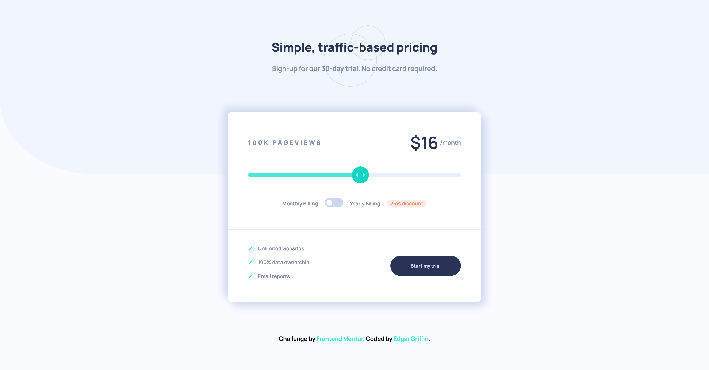

# Frontend Mentor - Interactive pricing component solution

This is a solution to the [Interactive pricing component challenge on Frontend Mentor](https://www.frontendmentor.io/challenges/interactive-pricing-component-t0m8PIyY8). Frontend Mentor challenges help you improve your coding skills by building realistic projects. 

## Table of contents

- [Overview](#overview)
  - [The challenge](#the-challenge)
  - [Screenshot](#screenshot)
  - [Links](#links)
  - [Built with](#built-with)
  - [Author](#author)

**Note: Delete this note and update the table of contents based on what sections you keep.**

## Overview

### The challenge

Users should be able to:

- View the optimal layout for the app depending on their device's screen size
- See hover states for all interactive elements on the page
- Use the slider and toggle to see prices for different page view numbers

### Screenshot

### Links

- Solution URL: [GitHub Repo](https://github.com/edgarcgriffinjr/pricing-app-fem)
- Live Site URL: [Add live site URL here](https://your-live-site-url.com)

### Built with

- HTML5
- CSS 
- Javascript (ES6+)

### Author

- Website - [Edgar Griffin](www.edgargriffin.com)
- Frontend Mentor - [@edgarcgriffinjr](www.frontendmentor.io/profile/edgarcgriffinjr)
- LinkedIn - [Edgar Griffin](https://www.linkedin.com/in/edgarcgriffinjr/)